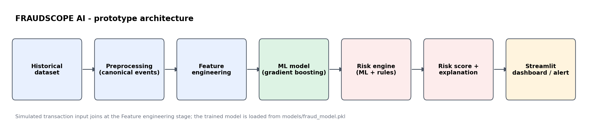

# FRAUDSCOPE AI

**Explainable real-time financial fraud intelligence & risk scoring platform**
*Detect. Explain. Prioritize. Protect.*

FRAUDSCOPE AI scores a financial transaction from **0 to 100**, assigns a risk level,
explains **why** it was flagged, and recommends an action — instead of returning a bare
"Fraud / Not Fraud" label.



---

## Quickstart (works in under 2 minutes)

```bash
git clone https://github.com/IshwariUgale-hub/FRAUDSCOPE-AI.git
cd FRAUDSCOPE-AI
pip install -r requirements.txt

python -m src.model --synthetic     # preprocess + train + evaluate + save model
streamlit run dashboard/app.py      # open the dashboard
```

`--synthetic` uses the built-in transaction simulator, so the prototype runs with **zero
downloads**. To train on real data instead, drop the Kaggle IEEE-CIS file at
`data/raw/train_transaction.csv` (optionally `train_identity.csv` too) and run:

```bash
python -m src.model --nrows 200000   # omit --nrows to use the full file
```

The pipeline detects the file automatically and maps it onto the same canonical schema.

---

## How it works

| Stage | File | What it does |
|---|---|---|
| Preprocessing | `src/preprocessing.py` | Raw data → canonical events (`user_id, timestamp, amount, device_id, location, is_fraud`). Adapts IEEE-CIS or generates realistic synthetic data. |
| Feature engineering | `src/features.py` | Behavioural features in one chronological pass — amount vs the customer's own baseline, hour, night flag, velocity, new device, new location, history depth. Also builds the customer profile store. |
| Model | `src/model.py` | Gradient-boosted trees, class-weighted, **chronological** train/test split, threshold picked from the precision–recall curve. |
| Risk engine | `src/risk_engine.py` | `score = ML component (max 60) + behavioural rules (max 40)`, plus the human-readable reasons. |
| Predictor | `src/predictor.py` | Single object the dashboard/API calls: `FraudScope.load().score(txn, user_id)`. |
| Dashboard | `dashboard/app.py` | Score a transaction, prioritised alert queue, model performance. |

### Why features are built in one chronological pass
Every feature uses only information available **before** the transaction, and the train/test
split is by time, not random. Otherwise the model sees a customer's future behaviour while
being tested on their past, and every metric looks far better than it really is.

### Why the score is split into two parts
The model catches patterns nobody wrote down; the rules are auditable and produce the
"why" sentence. Keeping them separate means an analyst can always see how much of a score
came from a black box and how much from an explicit signal.

---

## Example

```python
from src.predictor import FraudScope

fs = FraudScope.load()
result = fs.score({
    "amount": 85000, "hour": 2, "location": "Delhi", "device_id": "unknown-device",
    "txn_count_10min": 7, "seconds_since_prev": 45,
    "is_new_device": 1, "is_new_location": 1,
})
print(result["summary"])
```

```
Risk 93/100 (HIGH). Flagged because of unusually high amount; high transaction velocity;
new device; location deviation. Recommended action: Hold for additional verification and
route to a fraud analyst.
```

## Risk levels

| Score | Level | Meaning |
|---|---|---|
| 0–30 | LOW | Relatively normal transaction |
| 31–70 | MEDIUM | Some unusual signals require attention |
| 71–100 | HIGH | Multiple risk signals justify verification |

## Evaluation

Fraud data is heavily imbalanced, so accuracy is deliberately **not** reported. The model is
scored on **precision, recall, F1, PR-AUC, ROC-AUC and the confusion matrix**, all written to
`models/metrics.json` and shown in the dashboard's *Model performance* tab.

## Limitations

- The prototype does **not** connect to real bank accounts, UPI, payment gateways or customer data.
- Scores and thresholds are demonstration values, not banking-industry standards.
- A suspicious transaction is not automatically fraudulent; the system supports verification and
  investigation. False positives and false negatives are possible and must be monitored.

## Roadmap

Real-time streaming ingestion, SHAP explanations per prediction, graph-based fraud rings,
continuous model monitoring and drift alerts, secure scoring APIs, privacy-preserving /
federated learning.

## Project structure

```
data/raw  data/processed  notebooks  src  models  dashboard  screenshots  docs
```

Built by [Ishwari Ugale](https://github.com/IshwariUgale-hub).
